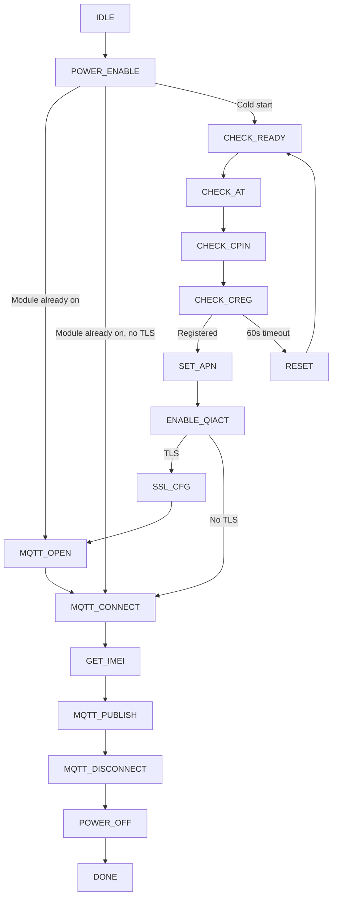

# SLM320 AT Command Reference

This document describes the AT commands used by the MeiG SLM320 driver in `slm320.c`. Commands are sent through `SLM320_SendCmd()` and responses are matched in `SLM320_CheckResponse()` against the UART RX buffer (`slm320_rx_buf`, 4096 bytes).

**Related files**

| File | Description |
|------|-------------|
| `slm320.c` / `slm320.h` | Driver and state machine |
| `EMPA_Slm320.c` | High-level connect / publish API |
| `../../config/mqtt_device_config.h` | Broker, client ID, topic, TLS flag |
| `../../config/network_config.h` | APN, PDP context |

**Broker settings** (`mqtt_device_config.h`):

- Host: `MQTT_BROKER_HOST` → `iot.tiremo.ai`
- Client ID: `MQTT_CLIENT_ID` (e.g. `hungarywp4qj_hun20`)
- Publish topic: `MQTT_TOPIC_PUB`
- Port: `MQTT_BROKER_PORT` → **8883** with TLS, **1883** without
- TLS: `MQTT_USE_TLS_CERTS` → **1** = mutual TLS, **0** = plain MQTT

**Vendor manuals referenced in code comments:**

- Plain MQTT: MeiG `connectmqtt.txt` (`AT+MQTTCONN`, `AT+MQTTPUB`, port 1883)
- TLS MQTT: MeiG `ssl.txt` + Quectel-compatible `QMT*` / `QSSLCFG` API

---

## State machine flow



Each call to `SLM320_RunStateMachine()` advances one step. The application must call it periodically from the main loop.

States in parentheses apply only when `MQTT_USE_TLS_CERTS == 1`:

- `SSL_CFG` — upload certs and configure TLS
- `MQTT_OPEN` — open TCP/TLS socket with `AT+QMTOPEN`

When TLS is disabled, the flow skips `SSL_CFG` and `MQTT_OPEN` and uses `AT+MQTTCONN` directly.

---

## 1. Power and basic commands

### `AT`

| Property | Value |
|----------|-------|
| **Purpose** | Check whether the module responds |
| **Used in** | `POWER_ENABLE`, `CHECK_AT` |
| **Expected response** | `OK` |

In `POWER_ENABLE`, if `AT` succeeds within 1.5 s the module is already running. Any existing MQTT session is torn down and the driver jumps to `MQTT_OPEN` (TLS) or `MQTT_CONNECT` (plain).

---

### `AT+CPOF`

| Property | Value |
|----------|-------|
| **Purpose** | Graceful modem shutdown |
| **Function** | `SLM320_PowerOff()` → `POWER_OFF` |
| **Expected response** | `OK` (10 s timeout) |

If there is no response, power is cut via GPIO anyway.

---

### `AT+TRB`

| Property | Value |
|----------|-------|
| **Purpose** | Software reboot (tribuffer reset) |
| **Function** | `SLM320_Reset()` |
| **Expected response** | `OK` |

---

### `ATE0`

| Property | Value |
|----------|-------|
| **Purpose** | Disable echo |
| **Used in** | `CHECK_AT` (after successful AT probe) |
| **Expected response** | `OK` |

---

### Boot URCs (unsolicited)

| URC | Meaning |
|-----|---------|
| `AT READY` | Module ready after power-on (preferred) |
| `RDY` | Alternative ready indication |

Waited up to 15 s in `CHECK_READY`. If neither arrives, the driver continues with AT probing.

---

## 2. SIM and network registration

### `AT+CPIN?`

| Property | Value |
|----------|-------|
| **Purpose** | Query SIM PIN state |
| **Used in** | `CHECK_CPIN` (up to 5 attempts) |
| **Success** | `+CPIN: READY` |

---

### `AT+CREG=0` and `AT+CREG?`

| Property | Value |
|----------|-------|
| **Purpose** | Read GSM network registration |
| **Used in** | `CHECK_CREG` |
| **Success** | `+CREG:` with `,1` (home) or `,5` (roaming) |
| **Timeout** | 60 s, poll every 2 s |

On timeout → `RESET` state (power cycle).

---

## 3. PDP context (data connection)

### `AT+QICSGP=<ctx>,1,"<apn>","<user>","<pass>",<auth>`

| Property | Value |
|----------|-------|
| **Purpose** | Configure APN for PDP context |
| **Used in** | `SET_APN` |
| **Example** | `AT+QICSGP=1,1,"internet","","",0` |
| **Macros** | `CELLULAR_PDP_CONTEXT`, `CELLULAR_APN`, `CELLULAR_APN_USER`, `CELLULAR_APN_PASS`, `CELLULAR_APN_AUTH` |

---

### `AT+QIACT?`

| Property | Value |
|----------|-------|
| **Purpose** | Query PDP activation status |
| **Used in** | `ENABLE_QIACT` |
| **Fast path** | If response contains `+QIACT: 1,1`, skip activation |

---

### `AT+QIDEACT=1`

| Property | Value |
|----------|-------|
| **Purpose** | Deactivate PDP context (clean start) |
| **Used in** | `ENABLE_QIACT` before `QIACT` |
| **Timeout** | 40 s |

---

### `AT+QIACT=1`

| Property | Value |
|----------|-------|
| **Purpose** | Activate PDP context and obtain IP |
| **Used in** | `ENABLE_QIACT` |
| **Timeout** | 150 s |
| **Success** | `OK` in RX buffer |
| **Failure** | `ERROR` → `RESET` |

After activation, `AT+QIACT?` is read again and the IP is logged.

---

### `AT+QIDNSCFG=<ctx>,"<pri>","<sec>"`

| Property | Value |
|----------|-------|
| **Purpose** | Set DNS servers on the PDP context |
| **Function** | `slm320_configure_dns()` |
| **Command** | `AT+QIDNSCFG=1,"8.8.8.8","1.1.1.1"` |
| **Used in** | `ENABLE_QIACT` (after PDP is active) |

---

### `AT+QIDNSGIP=<ctx>,"<host>"` (optional helper)

| Property | Value |
|----------|-------|
| **Purpose** | Resolve hostname via modem DNS |
| **Function** | `slm320_dns_resolve()` (implemented, not called by state machine) |
| **Expected URC** | `+QIURC: "dnsgip"` |
| **Note** | DNS pre-check failure does **not** block MQTT; the modem resolves again during `QMTOPEN` |

`AT+QIDNSGIP` returns `OK` immediately; the IP result arrives later as a URC. Do not treat missing URC at `OK` time as a hard failure.

---

## 4. TLS certificate commands

> Compiled and executed only when `MQTT_USE_TLS_CERTS == 1`.

### `AT+QFDEL="<file>"`

Deletes old certificate files from UFS before upload:

| File | Content |
|------|---------|
| `cacert.pem` | Root CA |
| `client.pem` | Client certificate |
| `user_key.pem` | Private key |

---

### `AT+QFUPL="<file>",<length>,100`

| Property | Value |
|----------|-------|
| **Purpose** | Upload a file to module flash (UFS) |
| **Function** | `slm320_upload_pem()` |
| **Flow** | 1) Send command → wait for `CONNECT` → 2) Send raw PEM bytes → wait for `+QFUPL:` |
| **Skip upload** | `+CME ERROR: 407` = file already exists; verify with `QFLST` instead |
| **Data source** | `MqttCerts_GetRootCA()`, `GetClientCert()`, `GetPrivateKey()` |

---

### `AT+QFLST="<file>"`

| Property | Value |
|----------|-------|
| **Purpose** | Verify file exists in UFS after upload |
| **Function** | `slm320_verify_cert_file()` |
| **Expected response** | `+QFLST:` with `UFS:<filename>` |

---

### `AT+QSSLCFG` (SSL context 2)

SSL context ID: `SLM320_SSL_CTX_ID` = **2**

| Command | Description |
|---------|-------------|
| `AT+QSSLCFG="cacert",2,"cacert.pem"` | CA certificate |
| `AT+QSSLCFG="clientcert",2,"client.pem"` | Client certificate |
| `AT+QSSLCFG="clientkey",2,"user_key.pem"` | Private key |
| `AT+QSSLCFG="seclevel",2,2` | Server + client verification (mutual TLS) |
| `AT+QSSLCFG="sslversion",2,4` | TLS 1.2 |
| `AT+QSSLCFG="ciphersuite",2,0xFFFF` | All supported cipher suites |
| `AT+QSSLCFG="ignorelocaltime",2,1` | Relax certificate date check |
| `AT+QSSLCFG="sni",2,1` | SNI enabled |
| `AT+QSSLCFG="negotiatetime",2,120` | TLS handshake timeout (seconds) |

File names in `QSSLCFG` omit the `UFS:` prefix.

---

## 5. MQTT configuration (`QMTCFG`)

All `QMTCFG` commands use client index **0** (`SLM320_MQTT_CLIENT_ID`).

### `AT+QMTCFG="ssl",0,1,2`

| Property | Value |
|----------|-------|
| **Purpose** | Enable MQTT over SSL using SSL context 2 |
| **Used in** | `SSL_CFG` |

When TLS is off, this block is not compiled.

---

### `AT+QMTCFG="version",0,4`

MQTT protocol version **3.1.1**.

---

### `AT+QMTCFG="session",0,1`

Clean session enabled.

---

### `AT+QMTCFG="keepalive",0,<seconds>`

Keep-alive from `MQTT_KEEP_ALIVE` (default **60** s).

---

## 6. MQTT connection — TLS path (`MQTT_USE_TLS_CERTS == 1`)

### `AT+QMTOPEN=0,"<host>",<port>`

| Property | Value |
|----------|-------|
| **Purpose** | Open TCP/TLS socket to broker |
| **Used in** | `MQTT_OPEN` |
| **Example** | `AT+QMTOPEN=0,"iot.tiremo.ai",8883` |
| **Retries** | Up to 3 |
| **Expected URC** | `+QMTOPEN: 0,0` (result 0 = success) |

**`+QMTOPEN` result codes (non-zero):**

| Code | Meaning |
|------|---------|
| 1 | Parameter error |
| 2 | MQTT client busy |
| 3 | PDP activation failed |
| 4 | DNS error |
| 5 | Network disconnected |

---

### `AT+QMTCONN=0,"<client_id>"`

| Property | Value |
|----------|-------|
| **Purpose** | Send MQTT CONNECT packet |
| **Used in** | `MQTT_CONNECT` |
| **Client ID** | `MQTT_CLIENT_ID` |
| **Timeout** | 60 s for URC |
| **Success URC** | `+QMTCONN: 0,0,0` or `+QMTCONN: 0,0` |

On retry failure, state returns to `MQTT_OPEN`.

---

### `AT+QMTDISC=0` / `AT+QMTCLOSE=0`

| Command | Purpose |
|---------|---------|
| `AT+QMTDISC=0` | Graceful MQTT disconnect |
| `AT+QMTCLOSE=0` | Close MQTT socket |

Used in `slm320_mqtt_disconnect_prep()` before reconnect or retry.

---

## 7. MQTT connection — plain path (`MQTT_USE_TLS_CERTS == 0`)

### `AT+MQTTCONN="<host>",<port>,"<client_id>",<keepalive>,1`

| Property | Value |
|----------|-------|
| **Purpose** | Single-step plain MQTT connect (MeiG native API) |
| **Used in** | `MQTT_CONNECT` |
| **Example** | `AT+MQTTCONN="iot.tiremo.ai",1883,"hungarywp4qj_hun20",60,1` |
| **Success** | `OK` without `+MQTTDISCONNECTED` |
| **Reference** | MeiG `connectmqtt.txt` |

**Do not use this command for TLS on port 8883** — use the `QMT*` path instead.

---

### `AT+MQTTDISCONN`

| Property | Value |
|----------|-------|
| **Purpose** | Disconnect plain MQTT session |
| **Used in** | `slm320_mqtt_disconnect_prep()` when TLS is off |

---

## 8. MQTT publish

### TLS: `AT+QMTPUBEX=0,0,0,0,"<topic>",<length>`

| Property | Value |
|----------|-------|
| **Purpose** | Publish QoS 0 message with explicit payload length |
| **Function** | `SLM320_PublishSensorData()` |
| **Parameters** | client=0, msgid=0, qos=0, retain=0 |
| **Flow** | 1) Send command → wait for `>` prompt → 2) Send raw payload bytes → wait for URC |
| **Success URC** | `+QMTPUBEX: 0,0,0` or `+QMTPUBEX: 0,0,1` |
| **Max payload** | `SLM320_MQTT_MSG_MAX` (560 bytes) |

`AT+QMTPUB` returns `+CME ERROR: 58` (`INVALID_COMMAND_LINE`) on SLM320 — always use **`QMTPUBEX`**.

---

### Plain: `AT+MQTTPUB="<topic>","<payload>",1,0,0`

| Property | Value |
|----------|-------|
| **Purpose** | Publish with payload inline in AT command |
| **Function** | `SLM320_PublishSensorData()` when TLS is off |
| **Success** | `OK` (60 s timeout) |

---

## 9. Diagnostics

### `AT+QIGETERROR`

| Property | Value |
|----------|-------|
| **Purpose** | Read extended error after a failed step |
| **Function** | `slm320_log_rx_error()` |
| **Expected response** | `+QIGETERROR:` |

---

### `AT+GSN`

| Property | Value |
|----------|-------|
| **Purpose** | Read IMEI |
| **Function** | `SLM320_GetIMEI()` |
| **Used in** | `GET_IMEI` state |
| **Result** | 15-digit string in `slm320_imei[]` |

---

## 10. Common CME errors

| Code | Name (typical) | Context in this driver |
|------|----------------|------------------------|
| **50** | `EXE_FAIL` | `AT+MQTTCONN` used with TLS / wrong API for port 8883 |
| **58** | `INVALID_COMMAND_LINE` | `AT+QMTPUB` not supported; use `AT+QMTPUBEX` |
| **407** | File exists | `QFUPL` skipped; file verified with `QFLST` |

---

## 11. Async URC summary

| URC | When |
|-----|------|
| `AT READY` / `RDY` | Cold boot complete |
| `+QMTOPEN:` | MQTT socket open result |
| `+QMTCONN:` | MQTT CONNECT result |
| `+QMTSTAT:` | MQTT disconnect / reject |
| `+QMTPUBEX:` | Publish result (TLS) |
| `+QIURC: "dnsgip"` | DNS lookup result |
| `CONNECT` | `QFUPL` upload prompt |
| `>` | `QMTPUBEX` payload prompt |

---

## 12. Hardware notes

| Pin | Function |
|-----|----------|
| **PA7** (PWRKEY) | LOW ≥ 1 s → power on |
| **PC4** (PWR) | CLEAR = enable module supply |
| **UART1** | `SLM320_UART_ID`, 115200 8N1 |

`SLM320_UART_RxCallback()` receives one byte per interrupt into `slm320_rx_buf` (max 4096 bytes).

Debug logs go to **UART0** via `slm320_log()`.

---

## 13. Quick reference table

| Command | Category | State / function |
|---------|----------|------------------|
| `AT` | Basic | `POWER_ENABLE`, `CHECK_AT` |
| `ATE0` | Basic | `CHECK_AT` |
| `AT+CPOF` | Power | `SLM320_PowerOff` |
| `AT+TRB` | Power | `SLM320_Reset` |
| `AT+CPIN?` | SIM | `CHECK_CPIN` |
| `AT+CREG=0` / `AT+CREG?` | Network | `CHECK_CREG` |
| `AT+QICSGP=...` | PDP | `SET_APN` |
| `AT+QIACT?` / `AT+QIACT=1` / `AT+QIDEACT=1` | PDP | `ENABLE_QIACT` |
| `AT+QIDNSCFG=...` | DNS | `slm320_configure_dns` |
| `AT+QFDEL` / `AT+QFUPL` / `AT+QFLST` | TLS files | `SSL_CFG` |
| `AT+QSSLCFG=...` | TLS | `SSL_CFG` |
| `AT+QMTCFG=...` | MQTT cfg | `SSL_CFG` |
| `AT+QMTOPEN` | MQTT TLS | `MQTT_OPEN` |
| `AT+QMTCONN` | MQTT TLS | `MQTT_CONNECT` |
| `AT+QMTDISC` / `AT+QMTCLOSE` | MQTT TLS | disconnect / retry |
| `AT+MQTTCONN` | MQTT plain | `MQTT_CONNECT` |
| `AT+MQTTDISCONN` | MQTT plain | disconnect |
| `AT+QMTPUBEX` | Publish TLS | `SLM320_PublishSensorData` |
| `AT+MQTTPUB` | Publish plain | `SLM320_PublishSensorData` |
| `AT+QIGETERROR` | Diagnostics | `slm320_log_rx_error` |
| `AT+GSN` | IMEI | `SLM320_GetIMEI` |

---

## 14. Typical successful TLS log sequence

```
[SLM320] SIM ready
[SLM320] Registered on network
[SLM320] APN configured
[SLM320] PDP context active
[SLM320] TLS ready
[SLM320] MQTT broker open
[SLM320] MQTT broker connected
```

After that, call `SLM320_PublishSensorData()` or `SLM320_PublishSensorDataApp()`.
